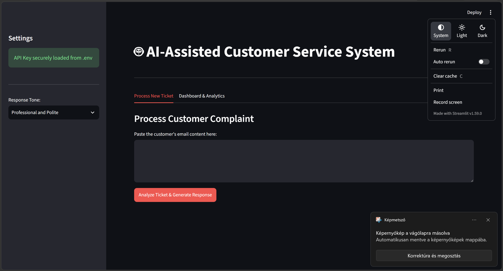
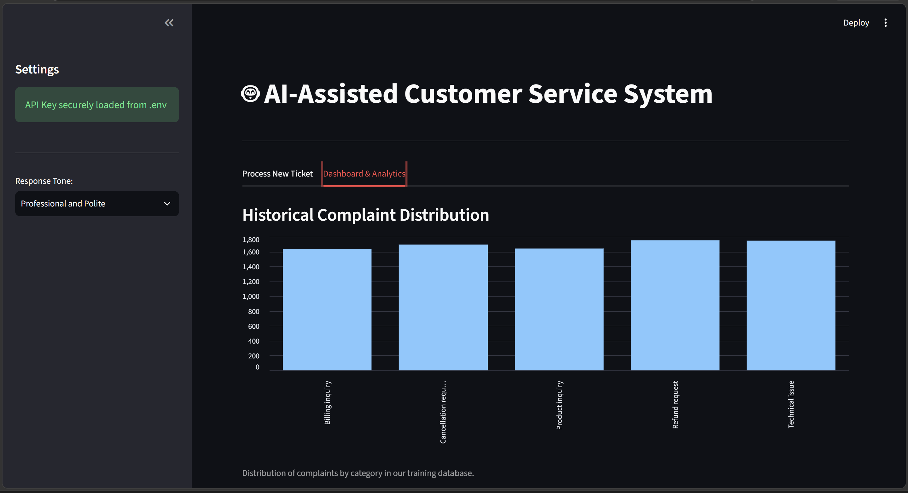

# AI-Assisted Customer Service Assistant

An AI-powered first-line customer support assistant that automates ticket handling. It uses Machine Learning to instantly categorize incoming emails and Generative AI to draft context-aware, personalized responses. The interactive web interface allows support agents to review predictions, dynamically adjust response tones, and analyze historical ticket trends.

## Screenshots

<table border="0">
  <tr>
    <td valign="top" width="50%">
      
    </td>
    <td valign="top" width="50%">
      
    </td>
  </tr>
</table>

## Technologies Used
* **Python:** Core programming language.
* **Streamlit:** Interactive web interface and analytics dashboard.
* **Scikit-Learn:** Machine Learning classification (`LinearSVC`) and text vectorization (TF-IDF).
* **Google Gemini 2.5 API:** Generative LLM for drafting tailored responses.
* **Pandas & Joblib:** Data manipulation and model serialization.

## How It Works
1. **Classification:** A trained ML model reads the incoming ticket and classifies it into a predefined category.
2. **Response Generation:** The predicted category and customer's text are passed to the Gemini API to craft a tailored reply.
3. **Control & Customization:** Agents can use the UI to adjust the tone (e.g., Professional, Apologetic) before finalizing the email.

## Project Structure
* `app.py`: Streamlit web interface and main application flow.
* `ml_model.py`: Text vectorization, model training, persistence, and prediction.
* `response.py`: Google Gemini API connection and prompt.

## Quick Start

1. **Install Dependencies:**
   ```bash
   pip install -r requirements.txt